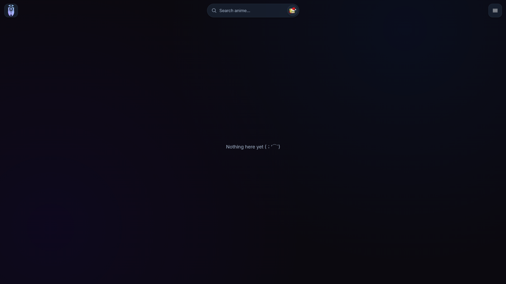
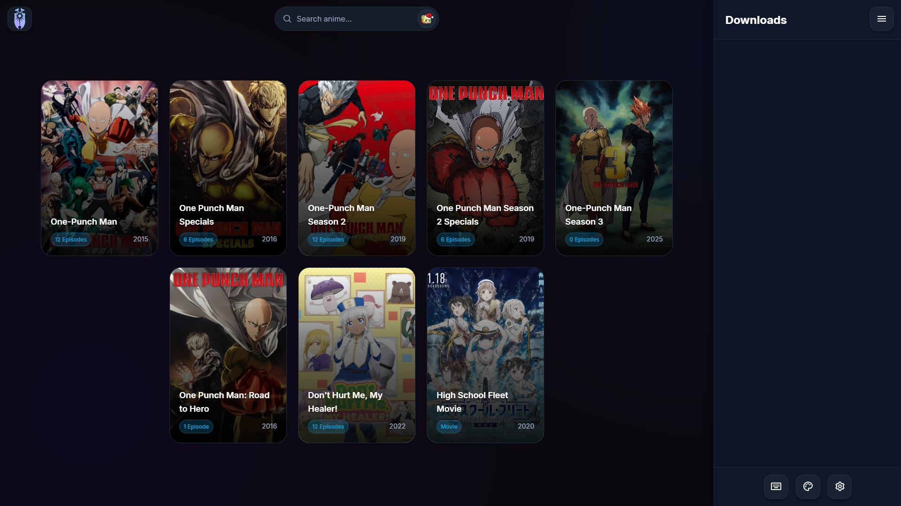
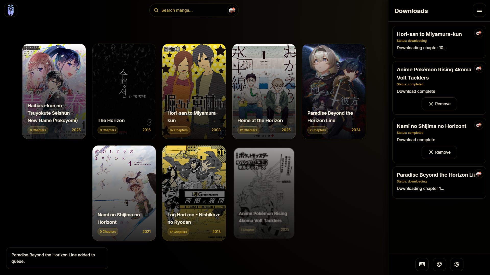
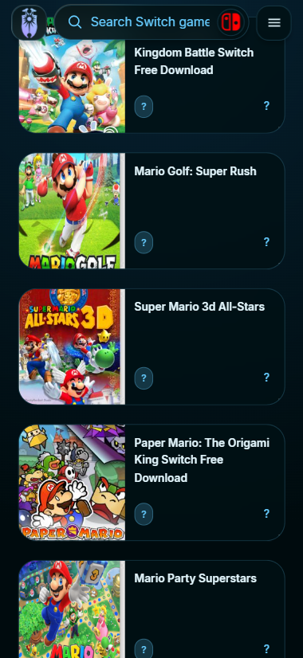
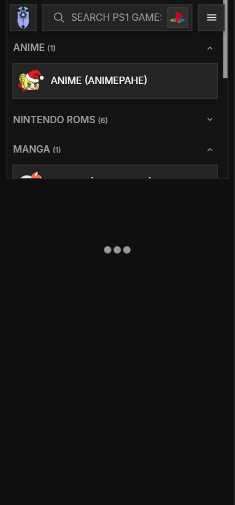

---

**Provider-based Node.js media downloader**

> [!IMPORTANT]
> This project is in active development, thing may and probably will break a lot
> 
> Also restart the server every once in a while to check for updates


# Features

- Provider switching, supporting a wide range of sources for downloading all kinds of media, all organised in one place
- One-step setup, like really it's just one bat file lol
- Optional authentication, so only users with the password can interact with the app
- Monitoring, the server has console logs from active downloads, clients can start and manage current downloads
- Shortcuts, because why not
- Mobile support, the site will look good on all your devices
- Customisation, with 14 themes because light and dark just simply isn't enough
- Download tracking, so you don't download the same thing twice. Shift left-clicking a result toggles its completed mark


# Screenshots

<details>
<summary>Desktop</summary>





</details>

<details>
<summary>Mobile</summary>

|||
|-----|-----|
|||

</details>


# Requirements

- [Node.js](https://nodejs.org/en)


# Setup

1. Clone or download this repository (cloning is recommended so you can get updates easily)
2. Run `LAUNCH.bat`. It will check for updates, install missing dependencies, and start the server
3. Open [http://localhost:3000](http://localhost:3000) in your browser

If something goes wrong, open an issue and describe your problem. It will be looked at as soon as possible


# Environment Variables

```sh
# BOTH required if you want authentication
AUTH_USERNAME=admin
AUTH_PASSWORD=pass

# Strongly recommended to use a long random string for security
SESSION_SECRET=secret

# If port 3000 is already in use, change this until it works
PORT=3000
```

> [!NOTE]
> All environment variables are optional. The server works even if there is no `.env` file


# Good To Know

> [!NOTE]
> Downloads are stored on the server where this is hosted. Clients cannot directly obtain or delete them

> [!NOTE]
> This project uses web scraping. The websites scraped are not designed for this purpose, so errors can and probably will occur

> [!NOTE]
> Some providers are error-prone and downloads can fail. Use the "Retry" button in the sidebar if needed